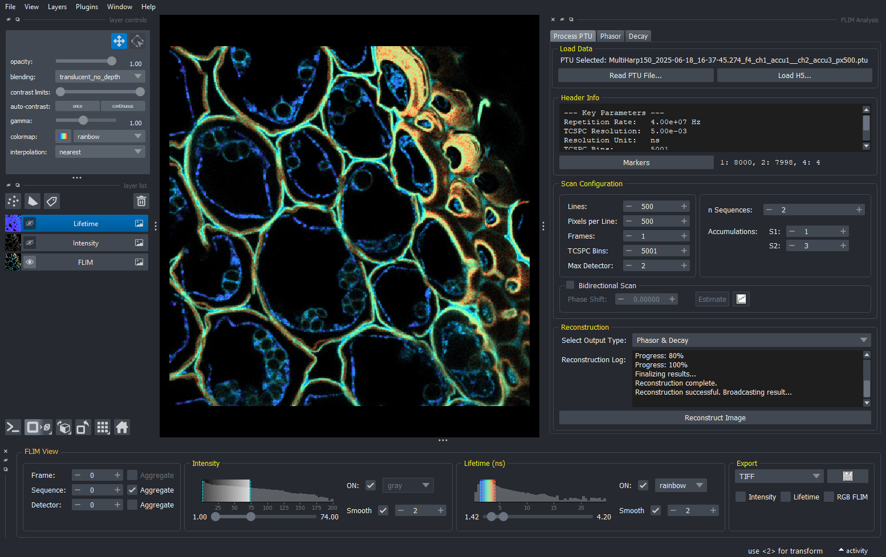
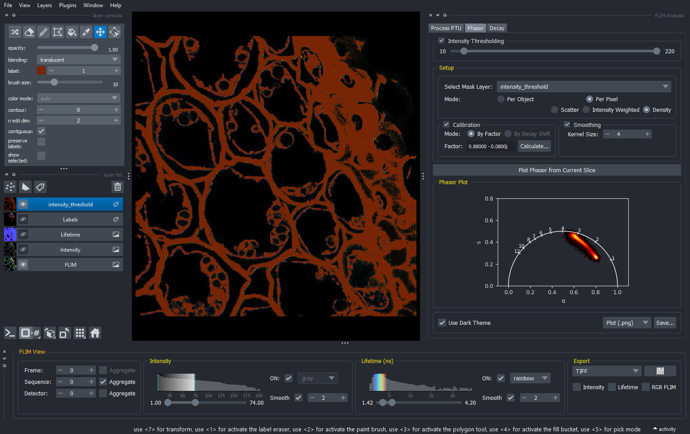
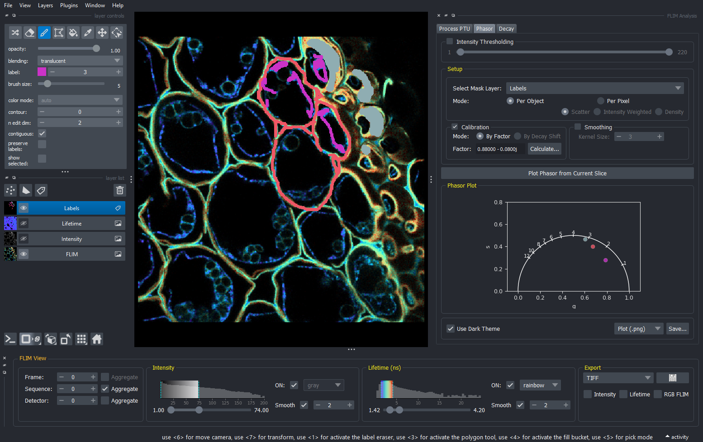
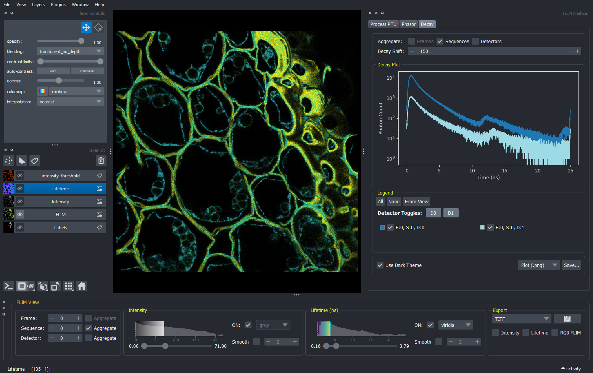

# FLOPA

**FLOPA - FLIM Open, Process, and Analyze**

[](https://opensource.org/licenses/MIT)

A python based tool for Fluorescence Lifetime Imaging Microscopy (FLIM) data opening, processing and analysis. Designed as a modular widget for the [napari](https://napari.org/) multi-dimensional image viewer. Planned as [napari](https://napari.org/) plugin.

FLOPA tool is made to handle the TTTR files from various FLIM data acquisition settings, providing a clear interface for configuring reconstruction parameters and generating insightful data products like intensity/lifetime images, decay curves, and phasor plots. 


| 1. PTU Reconstruction & Configuration | 2. Pixel-based Phasor |
| :---: | :---: |
|  |  |
| **3. Object-based Phasor** | **4. Decay Curve** |
|  |  |

--- 

### Key Features

**Currently implemented**
  * PTU file import
  * header / metadata configuration option (lines, pixels, frames, sequences, accumulations)
  * support for sequential and bidirectional scan (option to estimate and correct for bidirectional phase shift)
  * preprocessing tools (binning, smoothing)
  * intensity and mean arrival time image generation and export
  * plotting TCSPC decay histograms
  * phasor analysis (plot and export)
    * pixel-based phasor
    * object-based phasor (from label mask)

**Planned functionalities**
  * batch processing widget
  * multi-format data import (.sdt, and more)
  * segmentation from phasor plot (interactive ROI selection)
  * object-based TCSPC decay histograms
  * decay fitting

---

### Project Structure

The project is structured as a Python package, allowing its functions to be used in scripts and notebooks, with a top-level script for launching the napari GUI.

---

### Installation and Usage

This project can be used in two ways: as a standalone napari application (recommended for interactive use) or as a Python library (for scripting and notebooks).

**1. Installation**

First, set up the project and install its dependencies.

*   **Prerequisites:** Python 3.9+, Git
*   **Steps:**
    1.  **Clone the repository:**
        ```bash
        git clone https://your-repository-url/FLOPA.git
        cd FLOPA
        ```
    2.  **Create and activate a virtual environment:**
        ```bash
        conda create --name flopa python=3.9
        conda activate flopa
        ```
    3.  **Install the package in editable mode:**
        This installs all required dependencies from `pyproject.toml` and makes the `flopa` package importable.
        ```bash
        pip install -e .
        ```

**2. Usage**

#### Option A: Running the Napari Widget (interactive)

This is the primary method for interactive data exploration and analysis.

1.  Make sure your virtual environment is activated.
2.  Run the `launch_napari.py` script from the project's root directory:
    ```bash
    python launch_napari.py
    ```
This will launch a napari window with the full FLOPA widget docked and ready for you to load a file.

#### Option B: Using as a Python Library (for scripting and notebooks)

The core logic of FLOPA is accessible as a library, allowing you to build custom analysis workflows.

1.  Make sure your virtual environment is activated.
2.  Start a Python interpreter, an IPython session, or a Jupyter Notebook.
3.  Import and use the functions directly.
* Navigate to the /notebooks directory to explore the example notebooks.
